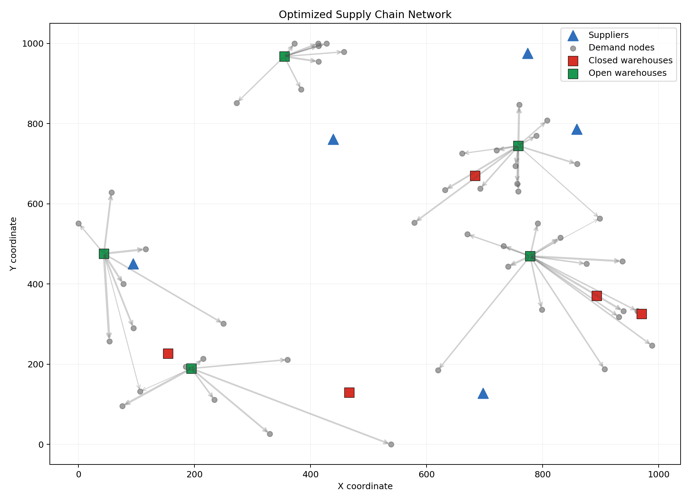
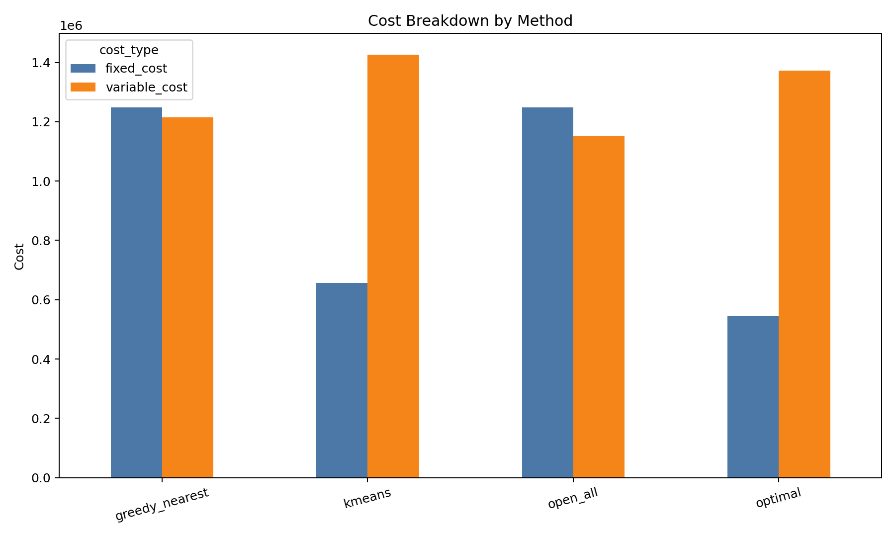
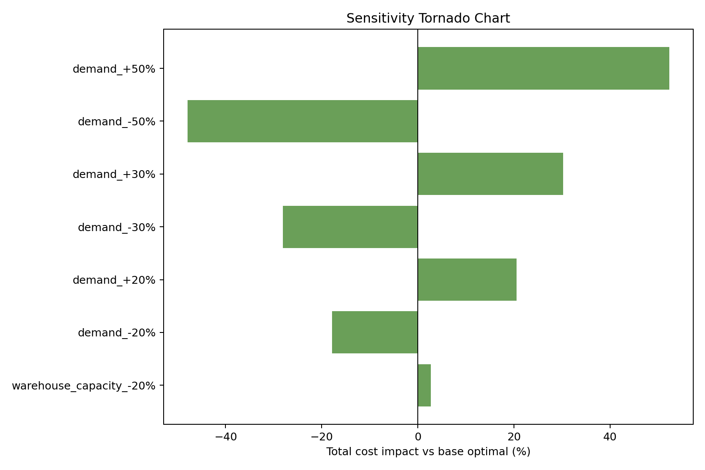
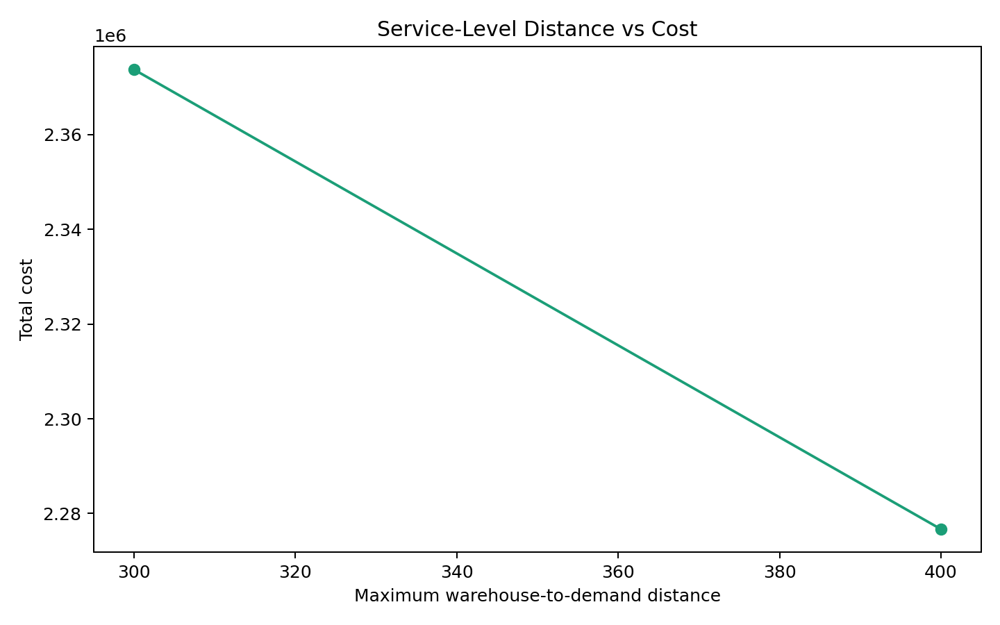
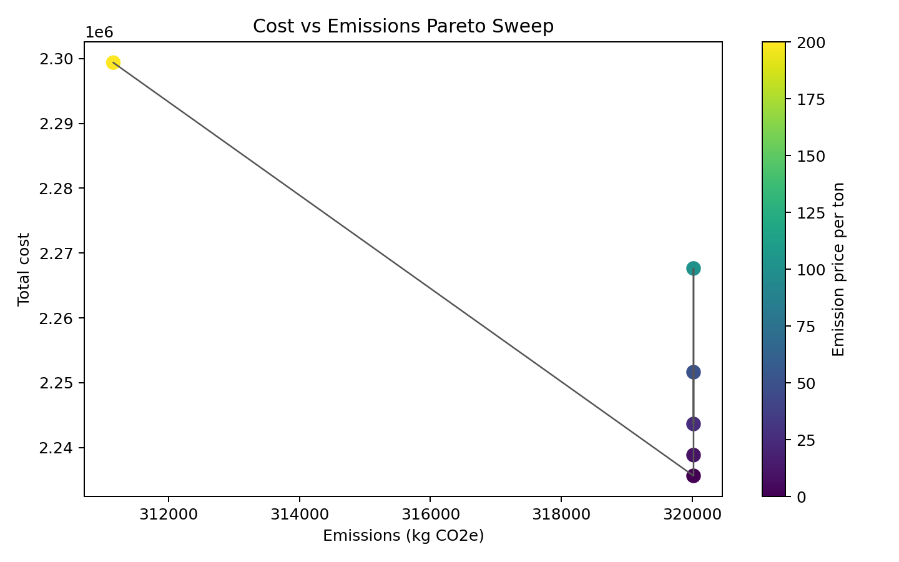

# Project Report: Supply Chain Network Optimization

## Executive Summary

This project formulates and solves a two-stage capacitated facility location problem for a synthetic supply chain network with 5 suppliers, 10 candidate warehouses, and 50 demand nodes. The model uses binary warehouse-open decisions and continuous supplier-to-warehouse-to-demand flow variables to minimize fixed facility cost and variable transportation cost.

The optimized network opens 5 warehouses (W01, W02, W05, W06, W08) at a total logistics cost of $1,917,967. Against operational baselines, the MILP reduces cost by 22.15% versus greedy nearest-warehouse assignment, 20.14% versus opening all facilities, and 7.90% versus a k-means location heuristic.

## Optimized Network

## Model Scale

| Metric | Value |
|---|---:|
| Total nodes | 65 |
| Candidate warehouses | 10 |
| Demand nodes | 50 |
| Binary variables | 10 |
| Continuous flow variables | 2500 |
| Solver variables | 2510 |
| Solver constraints | 2565 |
| Optimal fixed cost | $545,982 |
| Optimal variable cost | $1,371,985 |
| Optimal total cost | $1,917,967 |

## Baseline Comparison

| method         | status  | total_cost | opened_count | optimal_cost_reduction_pct |
| -------------- | ------- | ---------- | ------------ | -------------------------- |
| greedy_nearest | Optimal | $2,463,745 | 10           | 22.15%                     |
| open_all       | Optimal | $2,401,769 | 10           | 20.14%                     |
| kmeans         | Optimal | $2,082,458 | 4            | 7.90%                      |

## Robustness Analysis

Demand-shock experiments identify 2 robust warehouses (W01, W08) and 5 marginal warehouses (W02, W03, W05, W06, W10). Robust warehouses remain open across all tested demand scenarios; marginal warehouses switch open or closed depending on scenario pressure.

| scenario    | status  | total_cost | opened_warehouses       |
| ----------- | ------- | ---------- | ----------------------- |
| demand_-50% | Optimal | $999,479   | W01,W03,W08             |
| demand_-30% | Optimal | $1,379,507 | W01,W06,W08,W10         |
| demand_-20% | Optimal | $1,574,758 | W01,W06,W08,W10         |
| demand_+20% | Optimal | $2,311,257 | W01,W02,W03,W06,W08,W10 |
| demand_+30% | Optimal | $2,497,067 | W01,W02,W05,W06,W08,W10 |
| demand_+50% | Optimal | $2,920,759 | W01,W02,W05,W06,W08,W10 |

## Service-Level Tradeoff

The service-level extension constrains each demand node to be served within a maximum warehouse-to-demand distance. The resulting cost-of-service tradeoff is: 200 km: 8.77%, 300 km: 5.54%, 400 km: 0.00%.

| max_distance | status  | total_cost | opened_warehouses           |
| ------------ | ------- | ---------- | --------------------------- |
| 200          | Optimal | $2,086,179 | W02,W04,W06,W07,W08,W10     |
| 300          | Optimal | $2,024,201 | W01,W02,W03,W05,W06,W07,W08 |
| 400          | Optimal | $1,917,967 | W01,W02,W05,W06,W08         |

## Sustainability Extension

The emissions extension adds a carbon-price penalty to each km-unit shipped. This creates a cost-versus-emissions sweep that can be used as a Pareto-style planning discussion for sustainability-aware network design.

## Multi-Period Extension

The repository includes a three-period extension with demand growth and warehouse switching costs. Run `python main.py --multi-period` to solve it and export `results/multi_period_summary.csv` and `results/multi_period_transitions.csv`.

| period | demand_growth | opened_count | opened_warehouses       | total_flow        |
| ------ | ------------- | ------------ | ----------------------- | ----------------- |
| 1      | 1.0           | 5            | W01,W02,W05,W06,W08     | 5038.0            |
| 2      | 1.12          | 5            | W01,W02,W05,W06,W08     | 5642.560000000001 |
| 3      | 1.25          | 6            | W01,W02,W03,W06,W08,W10 | 6297.5            |

## Capacity Stress Test

When warehouse capacity is tightened by 20%, the model re-optimizes the facility mix and routing decisions. The stress-test summary is:

| scenario                | status  | total_cost | cost_increase_pct | opened_warehouses       |
| ----------------------- | ------- | ---------- | ----------------- | ----------------------- |
| warehouse_capacity_-20% | Optimal | $1,970,248 | 2.73%             | W01,W02,W03,W06,W08,W10 |

## Resume Bullets

- Formulated a 65-node two-stage capacitated facility location MILP with 10 binary open/close decisions and 2500 continuous flow variables in PuLP.
- Reduced total logistics cost by 22.15% versus greedy nearest-warehouse assignment and 20.14% versus an open-all baseline across 50 demand nodes.
- Sensitivity-tested the network under +/-20%, +/-30%, and +/-50% demand shocks; identified 2 robust warehouse locations and 5 marginal locations.
- Added service-level constraints and quantified max-distance cost tradeoffs across 3 feasible distance thresholds.

## Interview Talking Points

- The facility-opening decision creates fixed-charge binary variables, so this is a MILP rather than a pure transportation LP.
- The tight linking constraint `x_ijk <= d_k y_j` prevents flow through closed warehouses without using a numerically weak big-M.
- CBC solves the MILP by repeatedly solving LP relaxations inside a branch-and-bound search tree.
- LP relaxations often return fractional warehouse openings because the fixed-charge structure breaks the total unimodularity seen in pure transportation problems.
- For larger networks, practical scaling options include demand aggregation, candidate warehouse pruning, Benders decomposition, Lagrangian relaxation, and warm-start heuristics.
