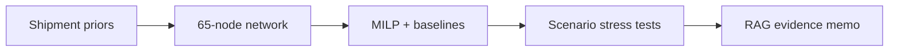

# Architecture

```mermaid
flowchart LR
    N0["Shipment priors"] --> N1["65-node network"]
    N1["65-node network"] --> N2["MILP + baselines"]
    N2["MILP + baselines"] --> N3["Scenario stress tests"]
    N3["Scenario stress tests"] --> N4["RAG evidence memo"]
    N4["RAG evidence memo"]
```

## Claim boundary

Real-data calibration; facility decisions and savings are optimization-model outputs.
